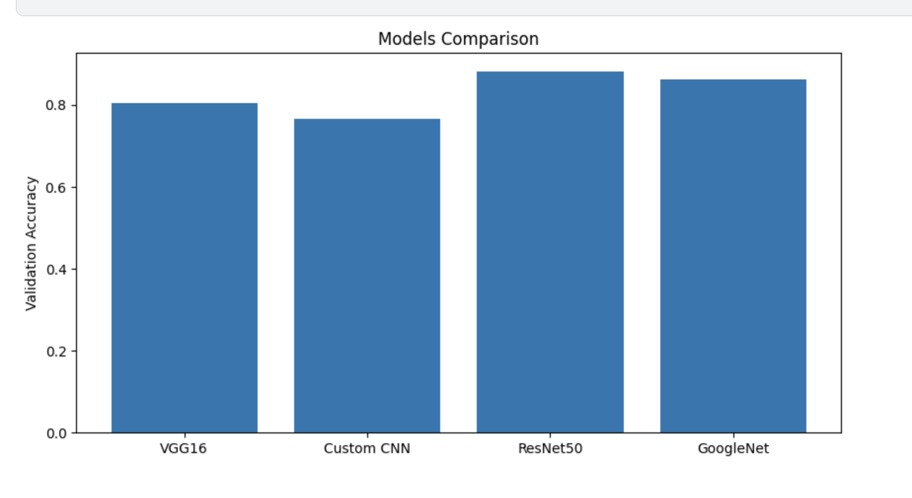
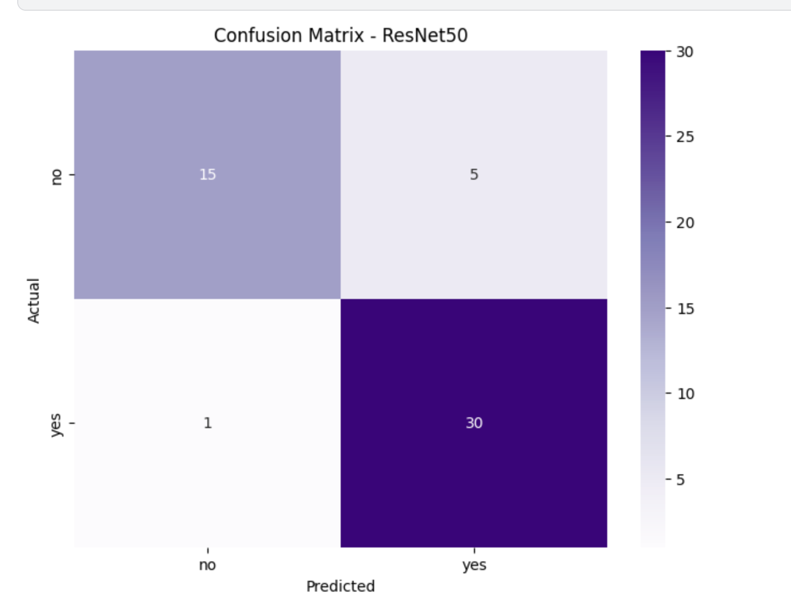
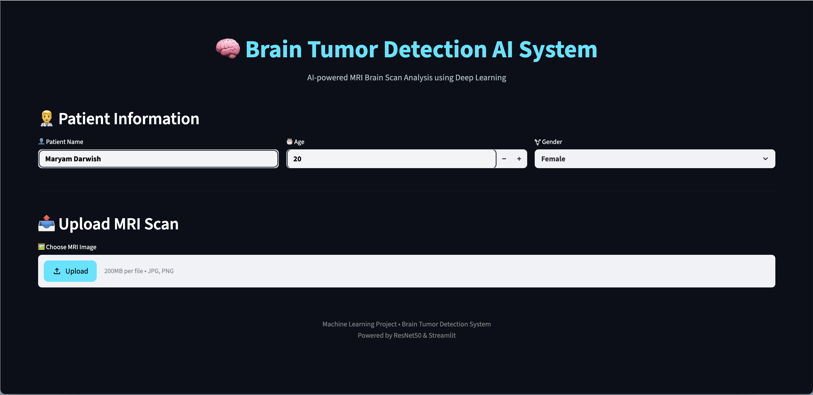

# 🧠 BrainDetect AI

AI-Powered Brain Tumor Detection System using Deep Learning and MRI Images.

---

## 📌 Project Overview

BrainDetect AI is a Deep Learning-based system designed to detect brain tumors from MRI scans using transfer learning and convolutional neural networks.

The project compares multiple deep learning architectures and deploys the best-performing model using Streamlit.

---

## 🚀 Models Tested

| Model      | Validation Accuracy |
| ---------- | ------------------- |
| VGG16      | 80.39%              |
| Custom CNN | 76.47%              |
| ResNet50   | 88.24%              |
| GoogleNet  | 86.27%              |

🏆 Best Model: ResNet50

---

## 🛠 Technologies Used

* Python
* TensorFlow / Keras
* OpenCV
* NumPy
* Matplotlib
* Seaborn
* Streamlit

---

## 📊 Results

### Model Comparison

---

### Confusion Matrix

---

### Streamlit App

